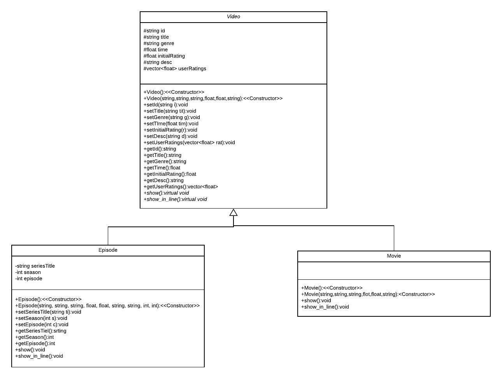

# Tecsney+
Emiliano Cabrera, Andrew Dunkerley, Do Hyun Nam

With the increasing popularity of streaming services such as Amazon Prime Video, Netflix, Disney+, Youtube and seemingly growing into oligarchies, it of furthermost importance for companies to adapt and push the industry forward. By the means of the present project, we aim to simulate/clone the basic functionalities of a streaming service, with the user being able to query the catalogue and to rate specific videos available in the platform. The development process was done in the C++ language, with the implementation of the following concepts:
- Classes
- Inheritance
- Polymorphism
- Pointers
- Access modifiers
- Abstract classes
- Method overwriting
- Vectors
- Exceptions

## The functionalities of the program vary, with the most notable being:
- See full catalogue of videos
- Filter catalogue by movies or series
- Search by movie/series name
- Filter from a certain rating range
- Filter by genre
- Get details about a video

## How the program works:
The program is object-oriented, with a base class calles video that holds the attributes and methods common to both movies and videos (as an abstrac class). Then two subclasses are created, called Movie and Episode. The Episode class holds more information than movie, as it has a series, season and episode number unique to each episode. In the main script, there are various functions declared to organize the interface, which mainly runs by the user inputting integers to make a choice, based on this choices the interface adapts and queries the requested data. Also, in the main script the files from the dbs are loaded into vectors of their respective movie or episode class, by using vectors it is more efficient when searching for the requested query. 

## Limitations
- The requests are limited once per runtime, if the user wishes to make another request, the program has to be executed again

